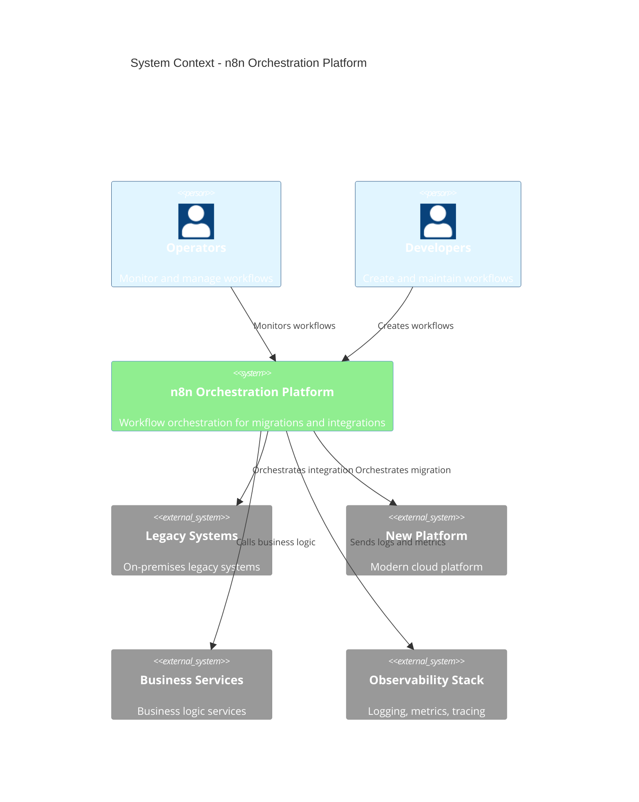

# C4 System Context - n8n Orchestration Platform

> **Icarus Nova** | High-level system context for n8n orchestration platform.

## System Context Diagram

## Actors

### Operators
- Monitor workflow execution
- Manage workflow errors
- Review workflow metrics
- Handle escalations

### Developers
- Create and modify workflows
- Test workflows
- Maintain workflow code
- Review workflow changes

## External Systems

### Legacy Systems
- On-premises legacy systems
- Legacy databases
- Legacy APIs
- Legacy file systems

### New Platform
- Modern cloud platform
- New APIs
- New databases
- Modern services

### Business Services
- Business logic services
- Validation services
- Transformation services
- Processing services

### Observability Stack
- Logging platform
- Metrics platform
- Tracing platform
- Alerting system

## Key Interactions

### Migration Orchestration
- n8n orchestrates migration from legacy to new platform
- Coordinates extraction, transformation, and loading
- Handles errors and retries
- Provides visibility into migration progress

### Integration Orchestration
- n8n orchestrates integration between systems
- Routes data and events
- Handles protocol translation
- Manages error recovery

## Related Documents

- [Orchestration Architecture](./orchestration-architecture.md)
- [Legacy Migration Flow](./legacy-migration-flow.md)
- [Orchestration Vision](../docs/orchestration-vision.md)

---

**Last Updated:** 2024  
**Maintained by:** Icarus Nova Architecture Team  
**Version:** 1.0
