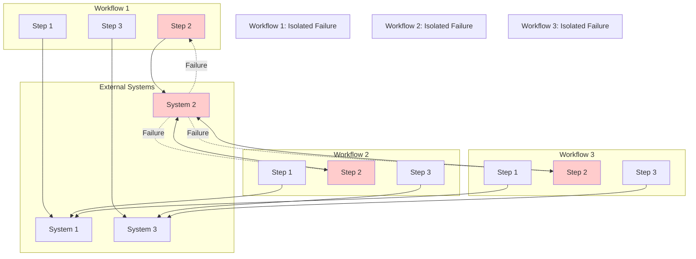

# Failure Isolation

> **Icarus Nova** | Failure isolation patterns to prevent cascading failures.

## Failure Isolation Diagram

## Isolation Principles

### Workflow Isolation

**Principle:**
- Each workflow is independent
- Failure in one workflow doesn't affect others
- Workflows have isolated error handling
- Workflows have isolated retry logic

### System Isolation

**Principle:**
- Failure in one system doesn't cascade
- Circuit breakers prevent cascading failures
- Timeouts prevent hanging workflows
- Bulkhead pattern isolates failures

## Isolation Patterns

### Circuit Breaker

**Pattern:**
- Monitor system health
- Open circuit on repeated failures
- Fail fast when circuit open
- Close circuit when system recovers

### Bulkhead

**Pattern:**
- Isolate resources per workflow
- Prevent resource exhaustion
- Limit impact of failures
- Maintain system stability

### Timeout

**Pattern:**
- Set timeouts on all operations
- Fail fast on timeout
- Prevent hanging workflows
- Enable quick recovery

## Benefits

### Failure Isolation Benefits

- **Resilience**: System continues operating despite failures
- **Stability**: Failures don't cascade
- **Recovery**: Faster recovery from failures
- **Visibility**: Clear failure boundaries

## Related Documents

- [Error Handling Strategy](../docs/error-handling-strategy.md)
- [Retry and Compensation Flow](./retry-and-compensation-flow.md)

---

**Last Updated:** 2024  
**Maintained by:** Icarus Nova Architecture Team  
**Version:** 1.0
