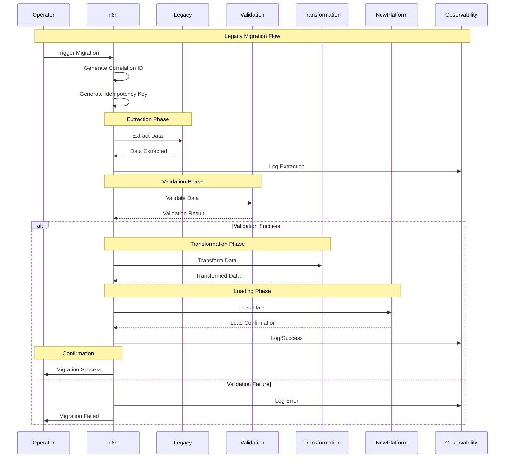

# Legacy Migration Flow

> **Icarus Nova** | Step-by-step flow for legacy system migration.

## Migration Flow Diagram

## Flow Stages

### 1. Initiation
- Operator triggers migration
- Generate correlation ID
- Generate idempotency key
- Initialize workflow state

### 2. Extraction
- Extract data from legacy system
- Validate extraction
- Log extraction results
- Handle extraction errors

### 3. Validation
- Validate extracted data
- Check data quality
- Verify business rules
- Handle validation errors

### 4. Transformation
- Transform data format
- Apply business rules
- Map to target schema
- Handle transformation errors

### 5. Loading
- Load data to new platform
- Verify loading
- Confirm data integrity
- Handle loading errors

### 6. Confirmation
- Confirm migration success
- Update migration status
- Log completion
- Notify operators

## Error Handling

### Error Scenarios

**Extraction Errors:**
- Legacy system unavailable
- Data format issues
- Network errors

**Validation Errors:**
- Invalid data
- Business rule violations
- Data quality issues

**Transformation Errors:**
- Transformation failures
- Schema mismatches
- Data mapping errors

**Loading Errors:**
- Target system unavailable
- Data conflicts
- Loading failures

### Error Recovery

- Retry with exponential backoff
- Compensate for partial failures
- Dead letter queue for permanent failures
- Manual intervention for critical errors

## Related Documents

- [Error Handling Strategy](../docs/error-handling-strategy.md)
- [Retry and Compensation Flow](./retry-and-compensation-flow.md)

---

**Last Updated:** 2024  
**Maintained by:** Icarus Nova Architecture Team  
**Version:** 1.0
