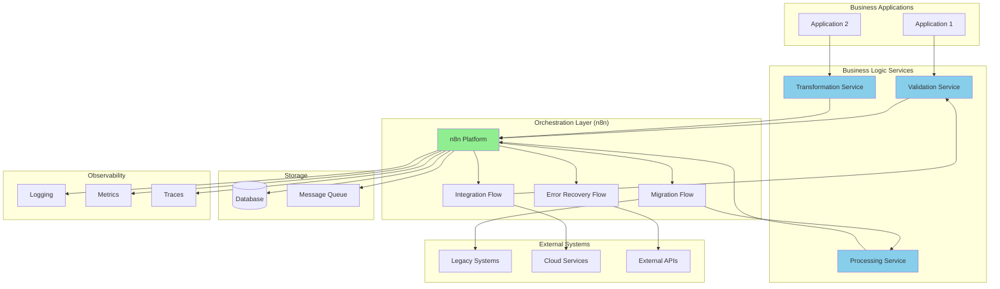

# Orchestration Architecture

> **Icarus Nova** | Architecture diagram showing n8n as orchestration layer.

## Architecture Diagram

## Architecture Layers

### Business Applications
- User-facing applications
- Trigger workflows
- Receive workflow results

### Business Logic Services
- Core business logic
- Data validation
- Data transformation
- Data processing

### Orchestration Layer (n8n)
- Workflow orchestration
- Error handling
- Retry logic
- Routing

### External Systems
- Legacy systems
- Cloud services
- External APIs
- Databases

### Storage
- Workflow state
- Message queues
- Data storage

### Observability
- Logging
- Metrics
- Tracing
- Alerting

## Key Principles

1. **n8n as Orchestrator**: n8n orchestrates, services execute
2. **Thin Orchestration**: Minimal logic in flows
3. **Externalized Logic**: Business logic in services
4. **Observable**: Full visibility
5. **Resilient**: Error handling and retries

## Related Documents

- [C4 System Context](./c4-system-context.md)
- [Orchestration Vision](../docs/orchestration-vision.md)

---

**Last Updated:** 2024  
**Maintained by:** Icarus Nova Architecture Team  
**Version:** 1.0
