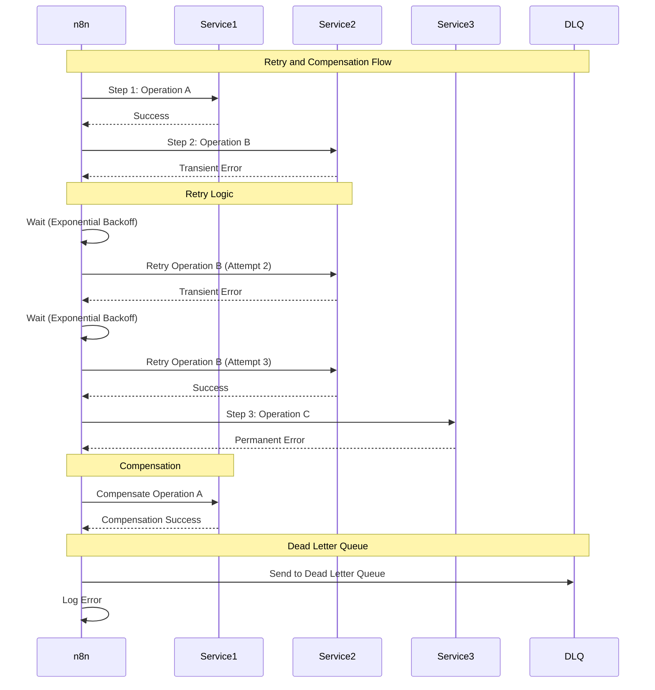

# Retry and Compensation Flow

> **Icarus Nova** | Error handling with retries and compensation.

## Retry and Compensation Flow Diagram

## Retry Strategy

### Exponential Backoff

**Pattern:**
- Attempt 1: Immediate
- Attempt 2: Wait 1s
- Attempt 3: Wait 2s
- Attempt 4: Wait 4s
- Attempt 5: Wait 8s (capped)

### Retry Configuration

**Parameters:**
- Max retries: 3-5
- Initial delay: 1s
- Max delay: 60s
- Backoff multiplier: 2

## Compensation Strategy

### Compensation Pattern

**When to Compensate:**
- Permanent error after partial success
- Cannot complete workflow
- Need to rollback changes

**Compensation Steps:**
1. Identify completed operations
2. Execute compensation for each
3. Verify compensation success
4. Log compensation actions

## Dead Letter Queue

### Dead Letter Queue Pattern

**Purpose:**
- Store failed workflows
- Enable manual review
- Prevent data loss
- Support reprocessing

**Contents:**
- Original input
- Error details
- Retry attempts
- Compensation status

## Related Documents

- [Error Handling Strategy](../docs/error-handling-strategy.md)
- [Failure Isolation](./failure-isolation.md)

---

**Last Updated:** 2024  
**Maintained by:** Icarus Nova Architecture Team  
**Version:** 1.0
