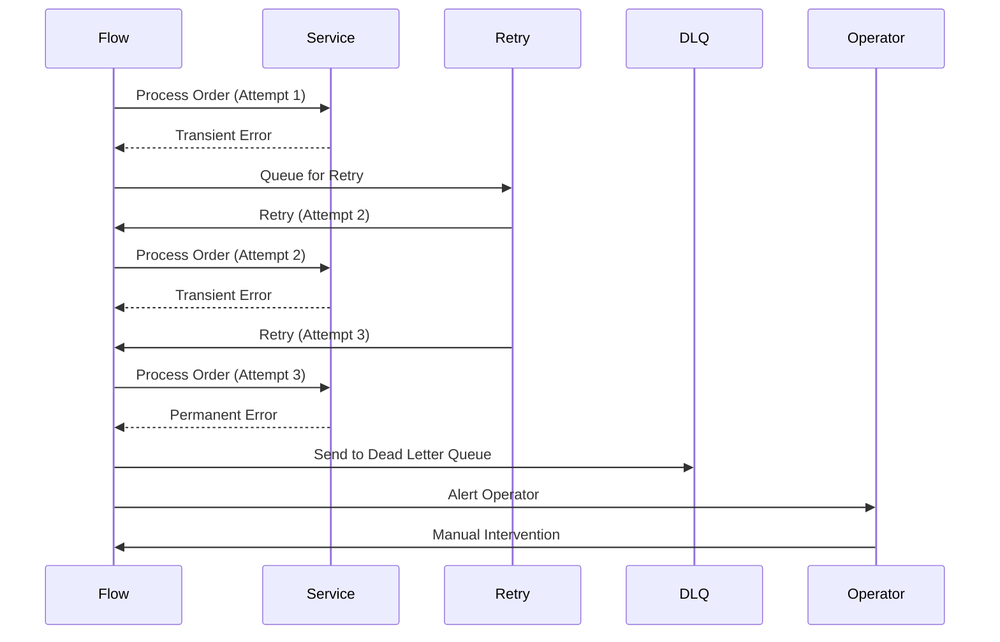

# Error-Controlled Flow Example

> **Icarus Nova** | Conceptual example of error handling in a workflow (NOT production code).

## Overview

This document describes a workflow with comprehensive error handling, retries, and escalation. This is a **conceptual example** for educational purposes.

## Flow Description

### Purpose

Process order data with robust error handling, retries, and escalation.

### Flow Steps

1. **Initialize**
   - Generate correlation ID
   - Generate idempotency key
   - Initialize error context

2. **Extract Order Data**
   - Call order service
   - Extract order data
   - Handle errors

3. **Validate Order**
   - Call validation service
   - Validate order data
   - Handle validation errors

4. **Process Order**
   - Call processing service
   - Process order
   - Handle processing errors

5. **Confirm Order**
   - Call confirmation service
   - Confirm order
   - Handle confirmation errors

## Error Handling

### Simulated Error Scenario

**Scenario:**
- Step 3 (Process Order) fails with transient error
- Flow retries with exponential backoff
- After max retries, escalates to dead letter queue

### Error Flow



### Retry Logic

**Configuration:**
- Max retries: 3
- Initial delay: 1s
- Max delay: 60s
- Backoff multiplier: 2

**Retry Attempts:**
- Attempt 1: Immediate
- Attempt 2: Wait 1s
- Attempt 3: Wait 2s
- After max retries: Dead letter queue

### Escalation

**Escalation Levels:**
1. **Automatic Retry**: Transient errors
2. **Alert Operators**: Permanent errors
3. **Dead Letter Queue**: Max retries exceeded
4. **Manual Intervention**: Critical failures

## Error Logging

### Error Log Structure

```json
{
  "correlationId": "process-order-20240115-550e8400",
  "workflowName": "process-order-data",
  "errorType": "TransientError",
  "errorMessage": "Service timeout",
  "step": "Process Order",
  "attempt": 3,
  "timestamp": "2024-01-15T10:30:00Z",
  "inputData": { "orderId": "12345" }
}
```

## Related Documents

- [Retry and Compensation Flow](../diagrams/retry-and-compensation-flow.md)
- [Error Handling Strategy](../docs/error-handling-strategy.md)
- [Failure Isolation](../diagrams/failure-isolation.md)

---

**Note:** This is a conceptual example for educational purposes. Production implementations should include proper error handling, security, compliance, and performance optimizations specific to your environment.

**Last Updated:** 2024  
**Maintained by:** Icarus Nova Architecture Team
